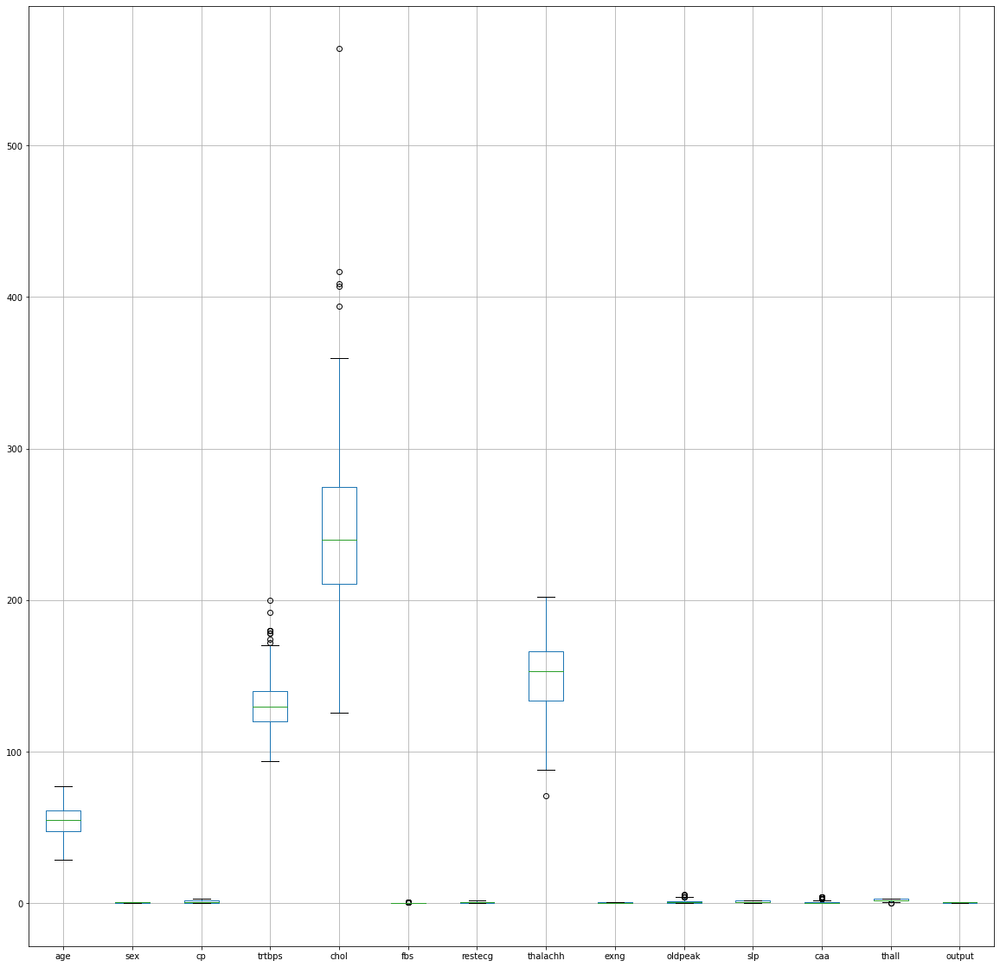
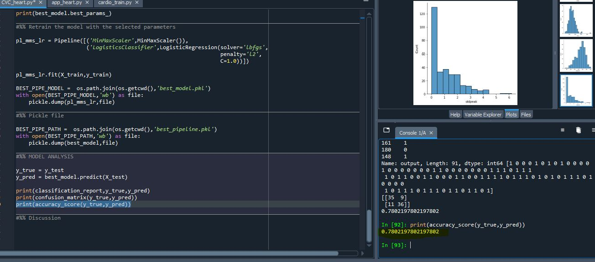

# Predict_Heart_Disease
 Trained data to predict chance of a person having heart attack

Title : To predict the chance of a person having heart attack.

Description : The objective of this project to predict the chance of a person having heart attack

Result 

# 

# Predict Heart Disease
 Trained with over 60000 IMDB dataset to categorize positive and negative

## To include images

## To include ur link

